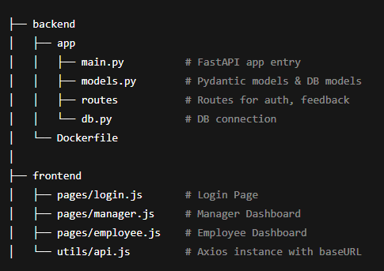

# dpd0-feedback
# 📝 Lightweight Feedback System

A lightweight and secure feedback tool designed for internal communication between managers and employees. It facilitates structured feedback, team visibility, and a clean dashboard view.

## [Feedback UI Screenshot]


## 🌟 Features

### ✅ Core MVP

#### 🔐 Authentication & Roles
- Two user roles: **Manager** and **Employee**
- Basic login system with role-based redirects
- Managers can view only their own team

#### 📨 Feedback Submission
- Managers can submit structured feedback with:
  - **Strengths**
  - **Areas to Improve**
  - **Sentiment** (positive / neutral / negative)
- Managers can **edit** previous feedback
- Employees can **acknowledge** feedback
- Multiple feedback entries per employee
- All feedback history visible to both sides

#### 👀 Feedback Visibility
- Employees see **only** their own feedback
- Feedback is **not** shared across employees
- Managers get an overview of all feedback submitted

#### 📊 Dashboards
- **Manager Dashboard:**
  - Team overview
  - Feedback count and sentiment trends
- **Employee Dashboard:**
  - Feedback timeline with acknowledgements

---

### 💡 Bonus Features (Implemented / To Be Implemented)
- [ ] Employee can request feedback
- [ ] Anonymous peer feedback (optional flag)
- [ ] Email or in-app notifications
- [ ] Tagging system for feedback (e.g. "communication", "leadership")
- [ ] Export feedback as PDF
- [ ] Markdown support for feedback/comments
- [ ] Employees can comment on feedback

---

## ⚙️ Tech Stack

| Layer      | Tech                          |
|------------|-------------------------------|
| Frontend   | [Next.js](https://nextjs.org/) + Tailwind CSS |
| Backend    | [FastAPI](https://fastapi.tiangolo.com/) (Python) |
| Database   | PostgreSQL (via [Render](https://render.com)) |
| Auth       | Custom Role-based Auth via JWT |
| Deployment | Frontend: [Vercel](https://vercel.com) <br> Backend: [Render](https://render.com) |
| Containerization | Docker (Python 3.11 Slim) |

---

## 🚀 Live Demo

- 🌐 Frontend: [https://dpd0-feedback.vercel.app](https://dpd0-feedback.vercel.app)
- 🖥️ Backend API: [https://dpd0-feedback.onrender.com](https://dpd0-feedback.onrender.com)

---

## 🐳 Docker Setup (Backend)

### Prerequisites:
- Docker
- Docker Compose (optional)

### 🔧 To Run Locally:

```bash
# Clone repo
git clone https://github.com/yourusername/lightweight-feedback-system
cd lightweight-feedback-system/backend

# Build the Docker image
docker build -t feedback-backend .

# Run the container
docker run -p 8000:8000 feedback-backend
```

## Project Structure

